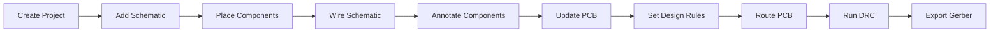

<div align="center">

# Altium Library

**Professional Altium Designer Component Library for Schematic Capture and PCB Layout**


**Owner:** Tran Dang Khoa Technology  
**Author:** Trần Đăng Khoa

</div>

---

## Overview

**Altium Library** is a reusable component library for **Altium Designer**, built to support schematic capture, PCB layout, footprint verification, and manufacturing output preparation.

This repository is intended for long-term use in electronics, embedded systems, robotics, microcontroller projects, power circuits, communication modules, and engineering practice boards.

---

## Key Features

- Ready-to-use component libraries for **Schematic** and **PCB Layout**.
- Support for common Altium library formats: `.SchLib`, `.PcbLib`, `.IntLib`.
- Installation guide for adding file-based libraries into Altium Designer.
- Essential Altium Designer shortcuts for faster schematic and PCB work.
- Component search keywords for quick placement.
- Gerber and NC Drill export guide for PCB manufacturing.
- PCB manufacturing checklist before sending files to a board house.
- Clear ownership and copyright under **Tran Dang Khoa Technology**.

---

## Repository Structure

```text
Altium_Library/
├── README.md          # Main project documentation
├── guide.md           # Full usage guide, shortcuts, and export notes
├── LICENSE            # Copyright and license notice
└── Library Files      # SchLib, PcbLib, IntLib, and related Altium files
```

> The folder structure may change depending on future library updates.

---

## Quick Start

### 1. Clone This Repository

```bash
git clone https://github.com/TranDangKhoaTechnology/Altium_Library.git
cd Altium_Library
```

### 2. Update to the Latest Version

```bash
git pull
```

### 3. Install the Library in Altium Designer

1. Open **Altium Designer**.
2. Open the **Components** or **Libraries** panel.
3. Go to **File-Based Libraries** or **Installed Libraries**.
4. Select **Install**.
5. Choose the library file from this repository:
   - `.IntLib` for integrated libraries.
   - `.SchLib` for schematic symbols.
   - `.PcbLib` for PCB footprints.
6. Click **Apply** or **OK**.
7. Search for a component in the panel to confirm that the library is loaded correctly.

---

## Typical Design Workflow



Recommended workflow:

1. Create a `.PrjPcb` project.
2. Create schematic `.SchDoc` and PCB `.PcbDoc` files.
3. Place components using `PP`.
4. Wire the schematic using `Ctrl + W`.
5. Annotate components using `TAA`.
6. Update the PCB using `DU`.
7. Configure design rules using `DR`.
8. Route the PCB using `Ctrl + W`.
9. Pour copper using `PG`.
10. Run DRC using `TD`.
11. Export Gerber and NC Drill files.

---

## Essential Altium Shortcuts

| Action | Shortcut |
|---|---|
| Place Component | `PP` |
| Wire / Interactive Routing | `Ctrl + W` |
| Rotate Component | `Space` |
| Mirror on X Axis | `X` |
| Mirror on Y Axis | `Y` |
| Annotate Components | `TAA` |
| Update Schematic to PCB | `DU` |
| Design Rules | `DR` |
| Design Rule Check | `TD` |
| Polygon Pour | `PG` |
| Place String / Text | `PS` |
| Measure Distance | `Ctrl + M` |
| Switch mm / mil | `Q` |
| 2D View | `2` |
| 3D View | `3` |
| Fit Board View | `VF` |
| Bottom View | `VB` |
| Single Layer Mode | `Shift + S` |

See the full shortcut list in [guide.md](guide.md).

---

## Component Search Keywords

| Component | Keyword |
|---|---|
| Resistor | `R`, `RES` |
| Resistor Network | `RN` |
| Polarized Capacitor | `CAP P` |
| Non-Polarized Capacitor | `CAP N` |
| Inductor | `L-` |
| Diode | `DIODE` |
| LED | `LED` |
| NPN Transistor | `NPN` |
| PNP Transistor | `PNP` |
| Relay | `RELAY` |
| Connector / Header | `HEAD`, `CON` |
| Switch / Button | `SW` |
| Crystal | `CRY` |
| Battery | `BAT` |
| 8051 MCU | `AT89XXX` |
| AVR MCU | `ATMEGAXXX` |
| PIC MCU | `PICXXX` |
| STM MCU | `STMXXX` |

---

## Gerber Export Checklist

Before sending a PCB to manufacturing, check the following items:

- Footprints match the real component datasheets.
- Pin 1 orientation is correct for ICs, diodes, LEDs, polarized capacitors, and connectors.
- Clearance rules, power trace width, signal trace width, and spacing are correct.
- Board outline and Keep-Out layer are correct.
- Silkscreen does not overlap exposed pads.
- DRC has been run using `TD`.
- Gerber and NC Drill files have been exported.
- The exported files have been checked in a Gerber viewer.

Altium Designer export paths:

```text
File > Fabrication Outputs > Gerber Files
File > Fabrication Outputs > NC Drill Files
```

---

## Documentation

| Document | Description |
|---|---|
| [guide.md](guide.md) | Complete installation guide, usage notes, shortcuts, component keywords, and Gerber export steps |
| [LICENSE](LICENSE) | Copyright and license notice |

---

## Recommended Usage

- Keep the library in a fixed folder path to avoid broken Altium library links.
- Always verify footprints before ordering real PCBs.
- For small SMD components, compare pad dimensions with the datasheet.
- For important projects, keep a project-specific copy of the library version used.
- Avoid editing shared footprints directly unless the impact on existing projects is checked.

---

## Author

**Tran Dang Khoa Technology**  
Created and maintained by **Trần Đăng Khoa**.

---

## License

Copyright © 2026 **Trần Đăng Khoa / TranDangKhoaTechnology**. All Rights Reserved.

This repository is the property of **Trần Đăng Khoa / TranDangKhoaTechnology**. Copying, redistributing, reselling, republishing, modifying for redistribution, or using this repository for commercial purposes without written permission is not allowed.
